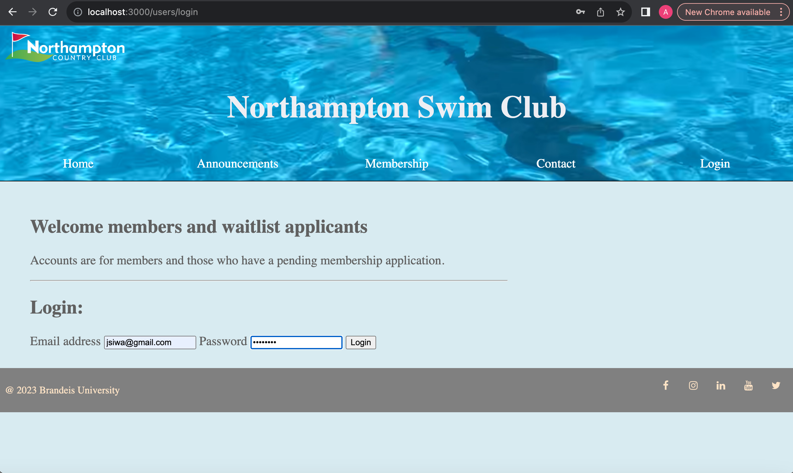
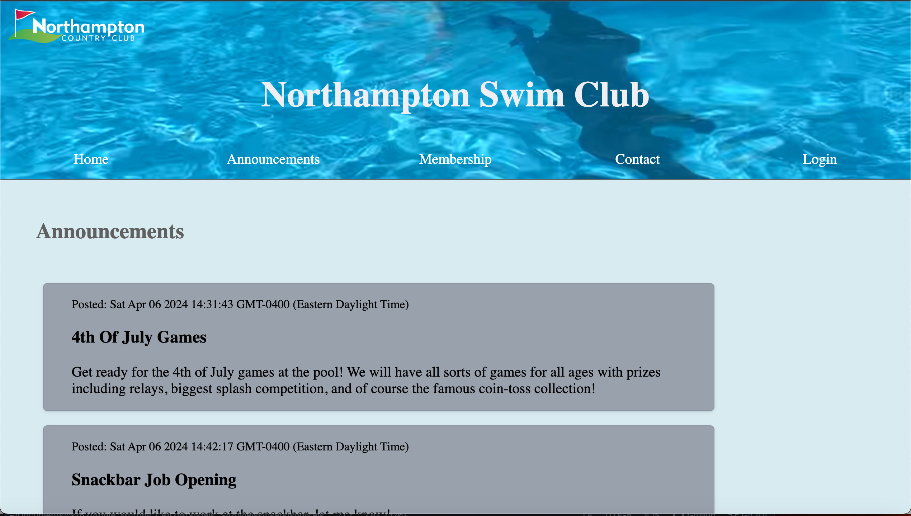
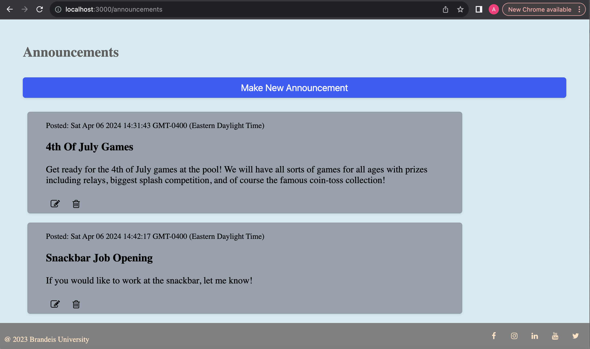
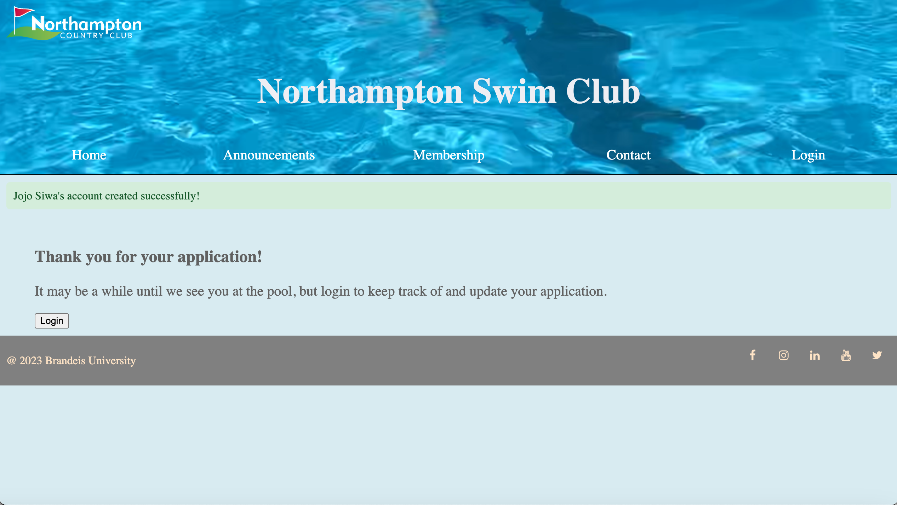
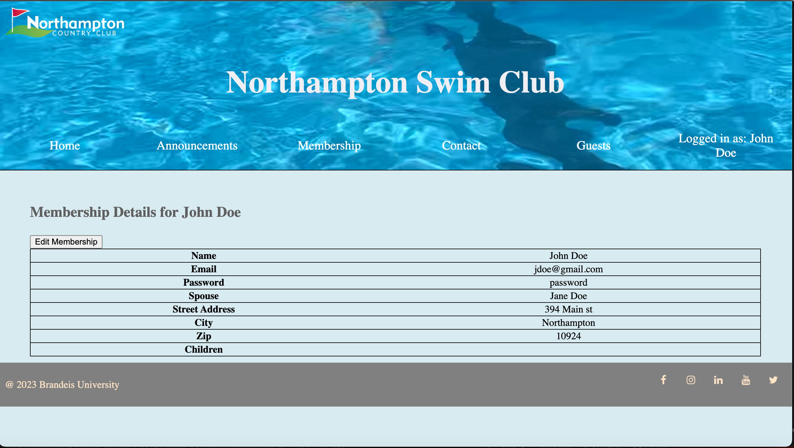

# Noho-Swimclub
A webapp and tool for the Northampton Swim Club.

## Uses
This tool was inspired by my previous summer job as a lifeguard at an outdoor pool. At first I wanted to just practice my skills from Webapp Development and make an aesthetic WebApp that allows users to log in and out, and if the user is "admin" then post updates to the site. Since, I decided to begin to expand this project to make paperwork easier. Currently to apply for a membership you have to mail in an application and then recieve an email about if you get it. Additionally, guest sign-ups are on a third-party app. In the works is managing memberships, the user may create an account by applying for a membership. Once they apply they are placed on the waitlist where admin can decide to offer or deny their membership. They can look for updates in their portal on their membership, and if they recieve an offer they can accept or deny. There is a third user view that is current member user. After I have further polished what I currently have, my goal is to move onto adding a signup page for current members to sign up to bring non-member guests to the pool. 

## Tools
This project was built using node.js and express with MongoDB as the database of choice. This Webapp uses cookies, passports, and user sessions.

## How to Start
Start by navigating into the project folder and typing node index.js to start running it, then navigate in a search bar to localhost:3000.

## A Tour of My Work

### Initial Features

When the user first open the Webapp it brings them to index.ejs, or the home page with general information such as a summary, hours, ect. 

You may log in here, notice that there is no option to create an account. This is because you must be a member or have applied for a membership in order to have an account. More to come on how this is done.

Here is what the announcements look like to general members or even users without an account. 

ADMIN SIDE USER: If one logs in with an "admin" account, there is an option to post, edit, or delete announcements. This feature is protected in the controller by only allowing users that are admin to execute "create" and "update."

### Features in Progress

What is currently being workshopped is the waitlist management system. Currently it mostly functions however there still needs to be some adjustments made. This is what it looks like for a non-user to see the membership page. 

If they click the apply button, they must fill out each field here, fields are validated upon creation and the program will not let you submit the application until all required fields are filled out.

After application, it encourages you to log in to check the progress of your membership.

NON MEMBER USER: While waiting for acceptance for memberships, you can check the status and take yourself off if for whatever reason you would like.

ADMIN SIDE USER: The admin can see all members and by clicking the family name of the members can see further information about pool members. Eventually there will be a count of how many members total and the stats in order to make it easier to keep track of membership and decide how many people to take off the waitlist. This feature has not yet been completed.

ADMIN SIDE USER: The admin can also see who is on the waitlist in order of who applied and offer or deny a membership. On the right pannel admin can keep track of how many memberships they have offered but have not yet been accepted. This part is also not complete as once offered or denied there is a problem with the routing once "offer" has been completed, meaning that the offer is updated on the user document however it causes an error with what "next" is. 

NON MEMBER USER: Once admin has given an offer, the non-member user has the opportunity to accept the memberhshp. This part is also awaiting completion as it is having a similar routing issue after the offer is accepted. "accept" is completed, changing isMember in the document to 'true' however it is not routed anywhere useful.

MEMBER USER: For the member user, rather than having updates on their membership they can see their membership details and edit. 

## What is Next
This project has extended past what it originally began as and after beinning the process of the membership tool I have begun to consider switching from a document-based DB to a relational DB to manage memberships. Regardless this has been a good exercise in my WebApp development skills and there are more tools to come!
